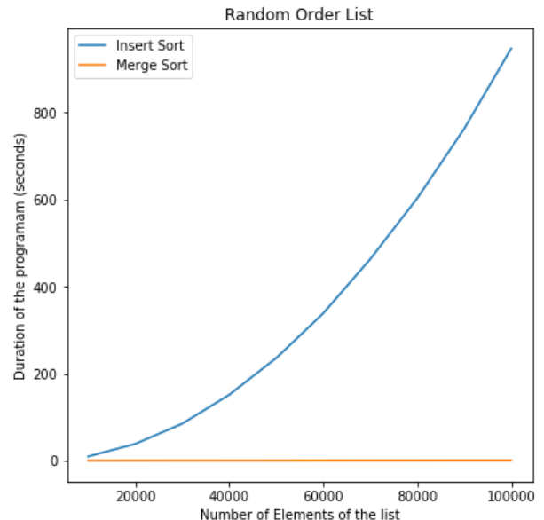
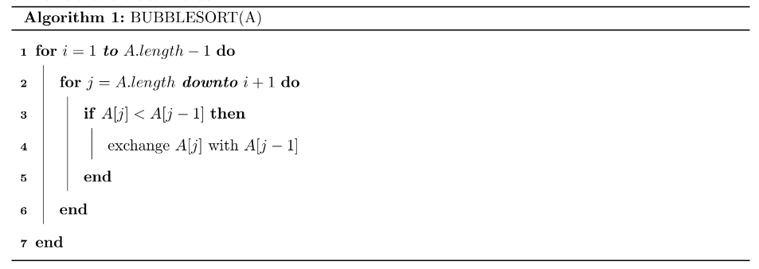

# Data Structures and Algorithms

This repository contains the material from the subject. The codes were written in Python and C++. 

Abstract
--- 

This is a course in applied mathematics focused on algorithm analysis and data
structures implementation. It's based on the [Stanford
Course](http://web.stanford.edu/class/archive/cs/cs161/cs161.1178/) and the
covered topics are, among others, 

1. Divide and conquer.
2. Trees and sorting. 
3. Randomized algorithms.
4. Graph algorithms. 
5. Greedy algorithms.
6. Dynamic programming. 
7. Intractable problems. 

[Repository](https://https://github.com/lucasmoschen/data-structures-and-algorithms)

Homeworks
---

**Homework 1:** Induction and comparison between the complexity of Insertion Sort
and Mergesort. We know the first one is $$O(n^2)$$ and the latter is $$O(n\log
n)$$.

 

**Homework 2:** Implementation of the structure Linked List, important when
one wants to add or remove at the beginning of a list (constant time). We also
proved the correctness of the algorithm bubblesort and study the growth of
functions. 

 

**Homework 3:**  We implemented the Red Black Tree, Radix Sort and more
algorithm analysis of Quicksort and Sorting in Place in Linear Time!

 

